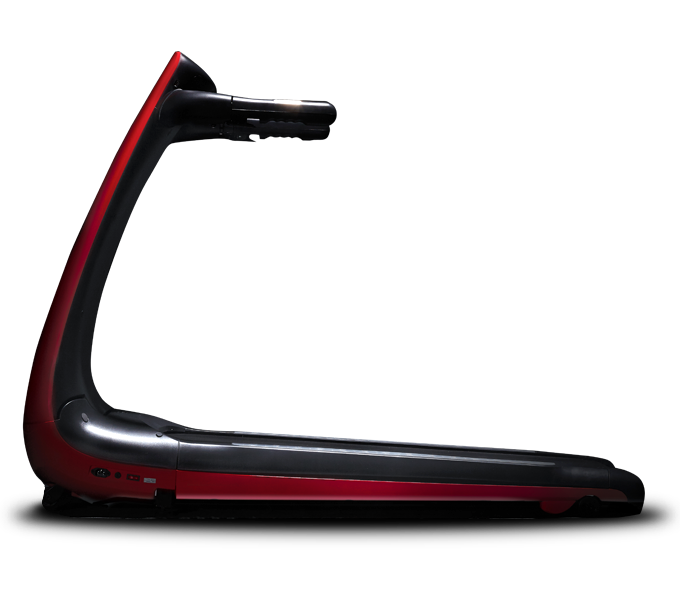

# 아이러너 홈페이지 클론코딩 프로젝트

데모 사이트 : 

[아이러너 홈페이지 클론코딩 프로젝트](http://codebebop.dothome.co.kr/I_runner/)

퍼블리싱을 배운지 5개월 즈음 되었을 때 진행한 토이 프로젝트이다.

- HTML

- CSS

- JS

를 사용했다.

횡스크롤 형식의 웹사이트가 신기해서 이걸 하려고 정했다. 어려운 웹사이트일수록 완성했을 때 배울 점이 많을 것이라 생각했기 때문이다.

## 주목 할만한 기능

### JS를 이용한 횡스크롤 구현

사용자가 아래로 스크롤하면 화면이 오른쪽에서 왼쪽으로 이동하면서 홈페이지 내용을 보여주는 기능이다. 이를 위해서 Swiper 라이브러리를 사용했다.

그런데 Swiper를 사용했더니 내가 의도했던 바와는 조금 다르게 동작했다. 스크롤을 내렸을 때 왼쪽으로 움직이긴 하나 그 속도가 너무 더디다는 점이었다.

이는 Swiper 라이브러리가 제공하는 기능의 한계임을 알고 화면을 스크롤 하는 것이 아닌 드래그 하는 것으로 타협하였다. 

### 스크롤 진행도에 따른 인터렉티브한 애니메이션

사용자가 스크롤하는 것에 반응해서 화면의 요소들이 움직이는 기능을 구현했다. 이는 Swiper 라이브러리의 parallax 기능을 사용했다. 원래 parallax 라이브러리를 사용할 생각이었지만 Swiper 라이브러리에도 간단한 parallax 기능을 지원하고 있어서 Swiper 라이브러리로 구현이 가능했다.

이는 HTML 태그에 Swiper 라이브러리에서 명시한 data attribute 를 추가하는 것 만으로 쉽게 사용이 가능했다.

```html
<div class="main__section--03__bottom" data-swiper-parallax-x="30%">
  <a href="" class="main__section--03__bottom__btn">
    <span class="main__section--03__bottom__btn__txt">Informaition</span>
  </a>
  
</div>
```

### 모바일 홈페이지를 따로 구현

보통 데스크탑 화면을 만들고 그 다음 미디어 쿼리를 사용해서 기존의 요소들의 CSS를 바꿔서 모바일 화면을 만드는데, 이 홈페이지 같은 경우는 데스크탑 화면을 구성하는 요소와 모바일 화면을 구성하는 요소가 완전히 달랐기 때문에 데스크탑에서 보일 html 파일과 모바일에서 보일 html 파일을 따로 만들었다.

그 후 사용자가 접속한 기기를 확인하여 알맞은 html 파일을 보여주도록 분기시켰다.

## 아쉬운 점

### 최적화

항상 과거의 프로젝트를 보면 아쉬운 것이 최적화 문제이다. 사실 이 때는 크롬 개발자 도구에 있는 LightHouse의 존재조차 몰랐기 때문에 당시에는 문제에 대해 인지조차 못 하고 있었다. 그러다보니 최적화를 고려하지 않은 CSS, DOM 구조, JS로 DOM 요소 애니메이션 등이 눈에 띈다.

### SEO

이 프로젝트 역시 SEO 문제를 인지하지 못 하고 있다. 비어있는 alt 속성과 href 속성 등이 눈에 띈다.
